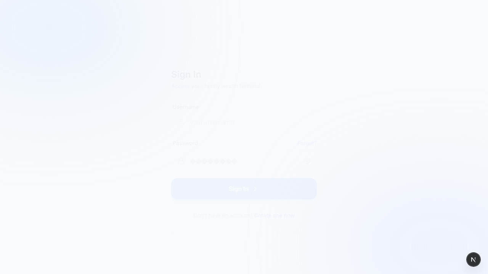
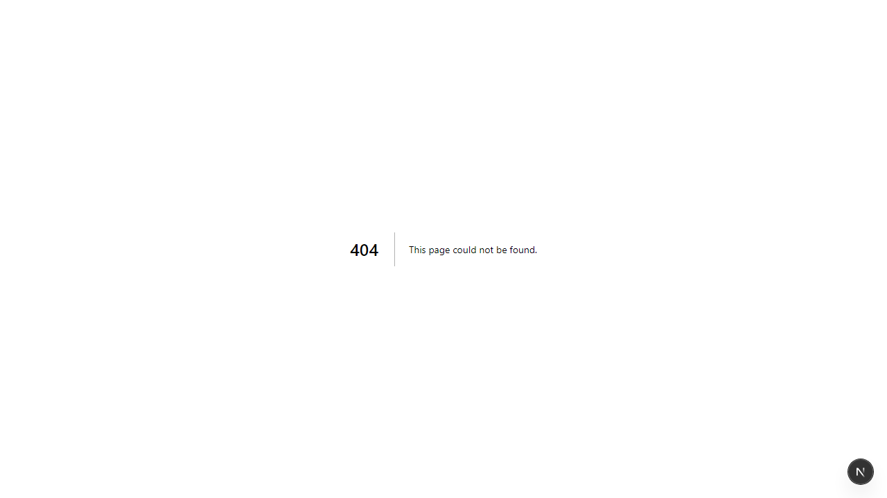

# WealthTrack Manager (2026)

## Multi-Entity Financial Portfolio & Tax Engine

WealthTrack Manager is a high-performance, private investment dashboard designed for managing complex family wealth. Built with Next.js 16 and Supabase, it allows a single manager to oversee multiple "Clients" (family accounts), track individual purchase "lots," and view consolidated exposure—all while calculating Indian Capital Gains tax in real-time.

## 🚀 Key Features

-   **Hierarchical Management**: Manage multiple independent clients (e.g., Personal, Spouse, Parents) under one secure login.
-   **The "Lot-Level" Ledger**: Tracks every buy as a unique batch, allowing for precise First-In-First-Out (FIFO) selling and tax optimization.
-   **Automated Tax Logic**: Built-in engine for LTCG (12.5%) and STCG (20%) based on the 2024-26 Indian Union Budget rules.
-   **Consolidated Holdings**: A unique "Union" view that aggregates a specific stock's exposure across all selected family accounts.
-   **Edge-Powered Market Data**: Automated price fetching via Supabase Edge Functions and pg_cron schedules.

## ✨ Visual Features

### Consolidated Dashboard

The main dashboard provides a high-level executive summary of all linked accounts. It calculates total invested value, current market value, and overall profit/loss in real-time. This view helps answer the question: "What is our total family exposure to this asset?"



### Sales Ledger & Tax Calculation

The sales view provides a detailed history of all realized gains and losses. The system automatically calculates the tax payable for each transaction based on Indian tax laws, distinguishing between Short-Term and Long-Term Capital Gains. This view helps answer: "How much tax do I owe?"


### Detailed Holdings View

The holdings page displays a granular, lot-level view of all open positions for a selected client. It tracks the purchase date, rate, and quantity for each individual transaction, which is crucial for accurate FIFO-based tax calculations.



## 🛠 Tech Stack

- **Framework**: Next.js 16
- **Database**: Supabase (PostgreSQL)
- **Authentication**: Supabase Auth
- **Styling**: Tailwind CSS

## 📂 Project Structure

```
/app
  /(auth)         # Signup and Login routes
  /dashboard
    /holdings       # Active "Open" positions
    /sales          # Realized P&L history
    /ledger         # New transaction entry (Buy/Sell)
    /consolidated   # Multi-client aggregated view
/components
  /dashboard        # Complex UI (Tables, Charts, Sidebar)
  /forms            # Transaction & Modal logic
/lib
  /calculations.ts  # Shared Tax & P&L math
/supabase
  /functions        # Market data update engine
```

## 🏗 Database Architecture

The system uses PostgreSQL Views to perform heavy financial math at the database level rather than the client level.

### Core Tables

| Table       | Description                                                                 |
| ----------- | --------------------------------------------------------------------------- |
| `profiles`  | Stores manager information, linked to `auth.users`.                         |
| `clients`   | Represents individual family member accounts being managed.                 |
| `assets`    | A master list of all tradable stocks and securities.                        |
| `purchases` | The "In" ledger. Every row is a unique purchase lot with a specific cost basis. |
| `sales`     | The "Out" ledger. Each sale is linked to a specific purchase lot.           |

### Key Views

- **`client_holdings` (View)**: Joins `purchases` and `assets` to calculate the current value, profit/loss, and balance quantity for each open position.
- **`sales_view` (View)**: Joins `sales` with their corresponding `purchases` to calculate realized gains and the precise `tax_payable` for each transaction.

## 💻 Code Flow

1.  **Authentication**: The `middleware.ts` file protects all routes within the `/dashboard` directory, redirecting unauthenticated users to the login page. User signup and login are handled by the pages in `app/(auth)`.
2.  **Dashboard**: After a successful login, the user is redirected to the `/dashboard/holdings` page. The main layout in `app/dashboard/layout.tsx` renders the `Sidebar` component.
3.  **Navigation**: The sidebar, located at `components/dashboard/sidebar.tsx`, provides links to the different sections of the application (`Holdings`, `Sales`, `Ledger`, etc.).
4.  **Data Display**: Each page within the dashboard fetches data from the corresponding Supabase views (`client_holdings`, `sales_view`) and displays it in a tabular format using components like `holdings-table.tsx` and `sales-table.tsx`.
5.  **Transactions**: The `/ledger` page allows users to enter new buy or sell transactions using forms from the `components/forms` directory. This data is then inserted into the `purchases` or `sales` tables in the database.

## 🏁 Getting Started

### 1. Prerequisites

-   **Node.js**: v22.0 or higher.
-   **npm**: v11.7 or higher.
-   **Supabase Account**: A free or paid Supabase account is required for the database and authentication.
-   **Market Data API Key**: An optional API key from a provider like Alpha Vantage or Dhan is needed for automated market data updates.

### 2. Installation

1.  **Clone the Repository**:
    ```bash
    git clone https://github.com/your-repo/wealthtrack-manager.git
    cd wealthtrack-manager
    ```

2.  **Install Dependencies**:
    ```bash
    npm install
    ```

### 3. Environment Variables

Create a `.env.local` file in the root of the project by copying the example file:

```bash
cp .env.example .env.local
```

Then, update the `.env.local` file with your Supabase project credentials and API key:

```
NEXT_PUBLIC_SUPABASE_URL=your_project_url
NEXT_PUBLIC_SUPABASE_ANON_KEY=your_anon_key
MARKET_DATA_API_KEY=your_key
```

### 4. Database Setup

1.  **Run the SQL Script**: Navigate to the Supabase SQL Editor in your project dashboard and execute the contents of the `CreateTables` file to set up the required tables, views, and database functions.
2.  **Enable Row Level Security (RLS)**: For data security, ensure that RLS is enabled on all tables that store client-specific information.
3.  **Deploy Edge Function**: To enable automated market data fetching, deploy the Supabase Edge Function:
    ```bash
    supabase functions deploy update-prices
    ```

### 5. Running the Application

Once the installation and setup are complete, you can run the development server:

```bash
npm run dev
```

The application will be available at `http://localhost:3000`.

## 📊 Decision Intelligence

This app is built to answer three questions every morning:

1.  "What is our total family exposure to this asset?" (Consolidated View)
2.  "How much tax do I owe if I sell today?" (Holdings/Sales Tables)
3.  "Which account is under-allocated?" (Dashboard Summary)
